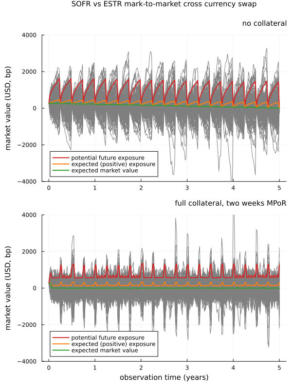

# Collateral Simulation for Cross Currency Swaps

This example illustrates the modelling of mark-to-market cross currency swaps (with standard and exotic coupon feature).

Furthermore, we use the swaps to illustrate the collateral model and the methodologies to simulate collateralised portfolios with [DiffFusion.jl](https://github.com/frame-consulting/DiffFusion.jl).

