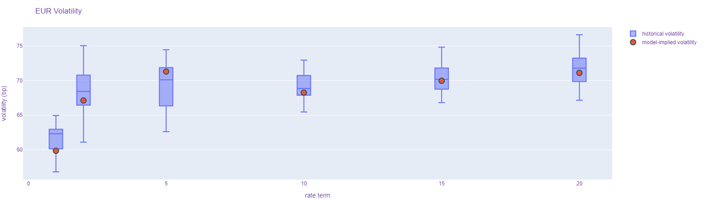
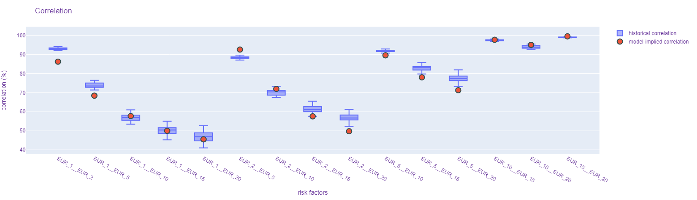
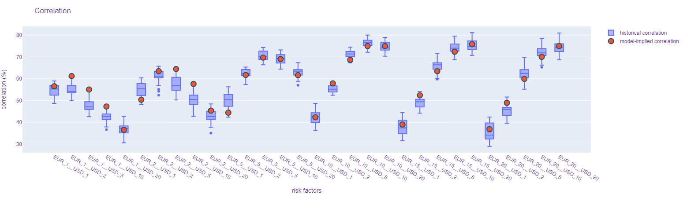

# Hybrid Model Calibration

This example illustrates the calibration of multi-factor interest rate models (see [RatesModelCalibration.ipynb](RatesModelCalibration.ipynb)) and hybrid cross asset models (see [HybridModelCalibration.ipynb](HybridModelCalibration.ipynb)).

As calibration objectives we use volatilities and correlations observed from historical time series of financial risk factors.

## Interest Rate Volatilities

## Interest Rate Correlations

## Cross Currency Interest Rate Correlations

